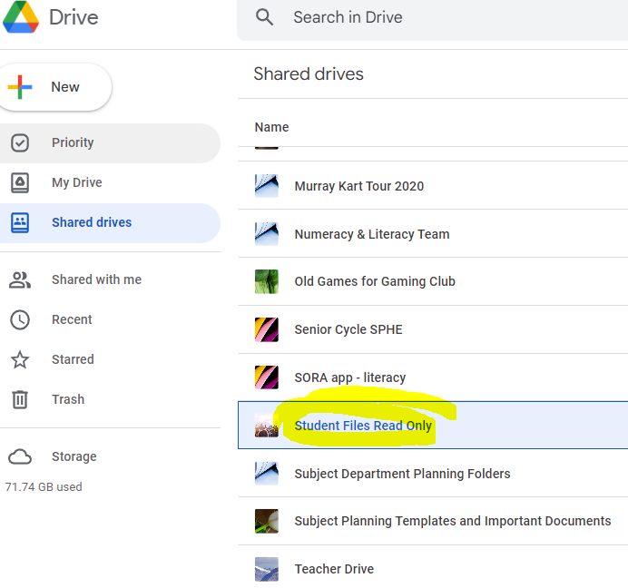

# Instructions  

  ** this file should contain student lesson instructions **

  _ students will see these instructions in a read-only workspace tab _

There are a bunch of easy to get sound files shared with all students. Drive: Shared folder. 



You can find all kinds of sounds at: https://freesound.org/

You just need to setup a free account. 

  ## Steps
  1. 
  2. 
  3. 

  Use [Markdown](https://gist.github.com/cuonggt/9b7d08a597b167299f0d) to format your instructions.

  For example, here is a code block in python3
```python
def hello_world():
  print("hello world!")
```

  